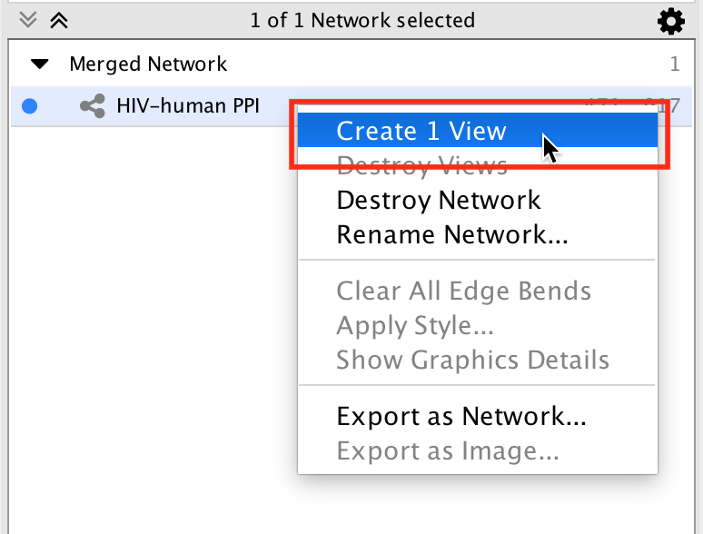
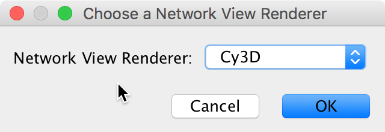
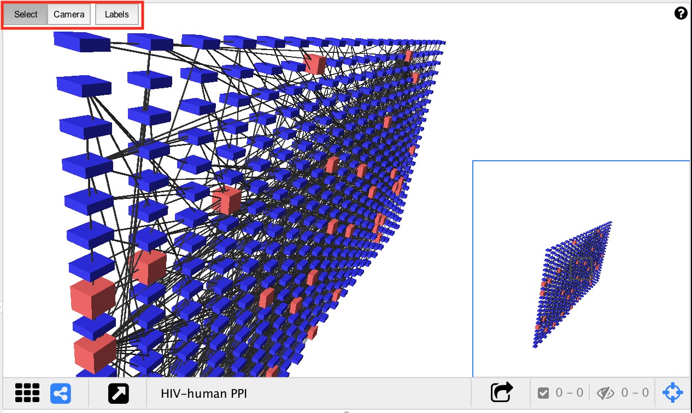
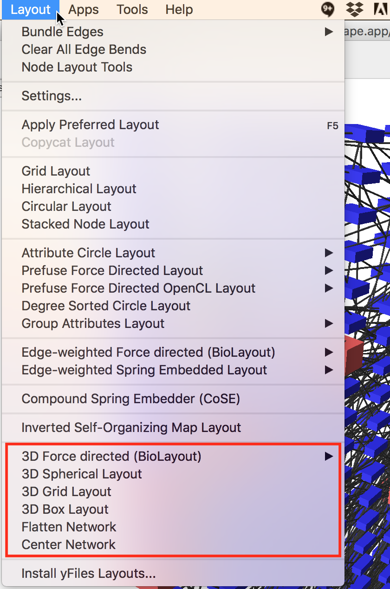
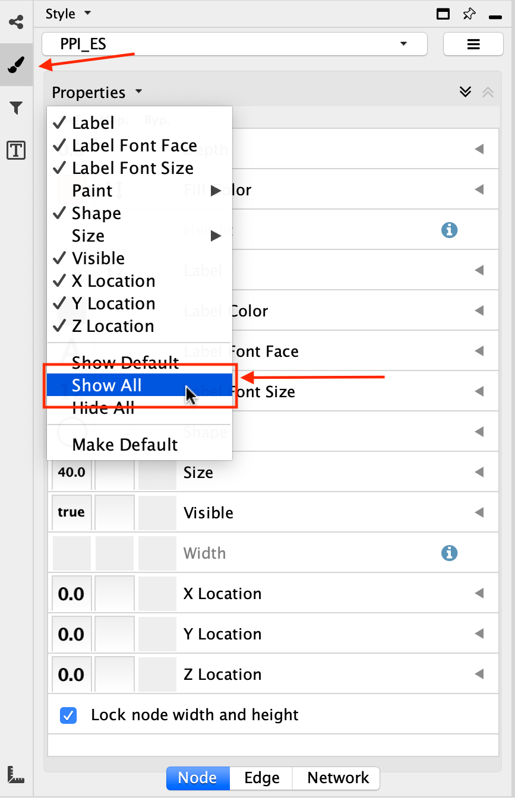

User Guide
==========

Creating a 3D View
------------------

To create a 3D view:

* Select a network in the Network panel.
* Right click on the network and select Create View (you may need to select Destroy View first).
* In the "Choose a network view renderer" pop-up select Cy3D.

|menu1| |popup|

To create a 3D view without destroying the existing view:

* Open the network view in the standard 2D renderer.
* Select all the nodes (Select > Nodes > Select All Nodes).
* Click the New network from selection toolbar button.
* Close the network view that was just created.
* Select the newly created network in the Network panel.
* Right click on the network and select Create View.
* In the "Choose a network view renderer" pop-up select Cy3D.

Controlling the Camera
----------------------

* Cy3D has 2 modes: camera mode and select mode.
* The modes are toggled using the toolbar in the 3D renderer view.

* In camera mode the mouse rotates the camera around the network. Mouse wheel moves the camera in and out.
* In select mode the mouse is used to select nodes and edges, and to activate the context menu.
* For a detailed list of controls click the (?) icon at the top right of the 3D renderer view.

**3D Renderer Controls**
 
=======  ====================================================
Toolbar  Buttons toggle between Select Mode and Camera Mode
Shift    Hold to force Select Mode
Alt      Hold to force Camera Mode
=======  ====================================================

**Select Mode**

===================  =========================
Left Click           Select Node or Edge
Left Click and Drag  Selection box
Ctrl + Left Click    Add to current selection
Right Click          Context menu
===================  =========================

**Camera Mode**

=================================  =============
Click and Drag (Near Center)       Orbit Camera
Click and Drag (Around Perimeter)  Roll Camera
Mouse Wheel                        Zoom In/Out
=================================  =============

**Keyboard Controls**

=====================  =================================
Up, Down, Left, Right  Orbit camera (at constant speed)
R                      Reset camera to default position
=====================  =================================

Layouts
-------

Currently the only way to move nodes around in 3D is to apply a layout.

There are 4 3D layout algorithms available in the Layout menu:

* 3D Force Directed (BioLayout)
* 3D Spherical
* 3D Grid
* 3D Box

Additionally there are two other ways to manipulate the graph which are implemented as layouts:

Flatten Network
  Sets the Z coordinate of every node to zero. It is useful if you would like to apply a 
  2D layout, because most of the existing 2D layouts just ignore the Z coordinate. Apply 
  the Flatten layout before or after applying a 2D layout to fix the results of the 2D layout.

Center Network
  Computes the centroid of all the nodes and translates the graph so that the centroid is the new origin.

Visual Properties
-----------------

To view the complete list of visual styles that are supported by Cy3D...

  * Go to the *Style* panel
  * Click on the *Properties* drop down menu.
  * Select *Show All*
  * This can be done for each of the *Node*, *Edge*, and *Network* tabs.

